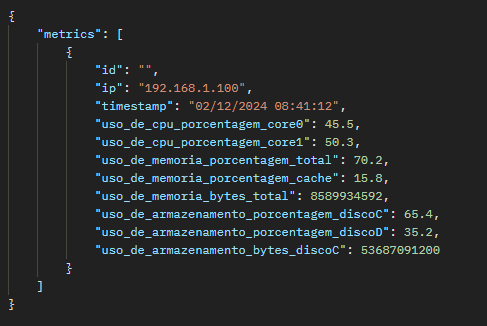

# Metric Storage Server

Este é um servidor de armazenamento de métricas que utiliza MongoDB e gRPC para receber e fornecer métricas sobre o uso de recursos como CPU, memória e armazenamento.

## Requisitos

Antes de rodar o projeto, você precisa ter os seguintes requisitos instalados em sua máquina:

- [Visual Studio Code](https://code.visualstudio.com/)
- [SDK .NET 7.0 ou superior](https://dotnet.microsoft.com/download/dotnet)
- [MongoDB Atlas](https://www.mongodb.com/cloud/atlas) ou uma instância local do MongoDB
- [Postman](https://www.postman.com/) para testes (opcional, para testar a API)

## Como rodar o projeto

### 1. Clone o repositório

Clone o repositório para a sua máquina local:

```bash
git clone https://seu-repositorio.git
```

### 2. Abra o projeto no VS Code

### 3. Instale as dependências
Se necessário, instale as dependências do projeto usando o seguinte comando no terminal do VS Code:

```bash
dotnet restore
```

atualmente o servidor está sendo hospedado na porta 5001 de maneira fixa, logo, as requisições devem ser endereçadas de acordo.

resposta esperada da requisição get metrics:
